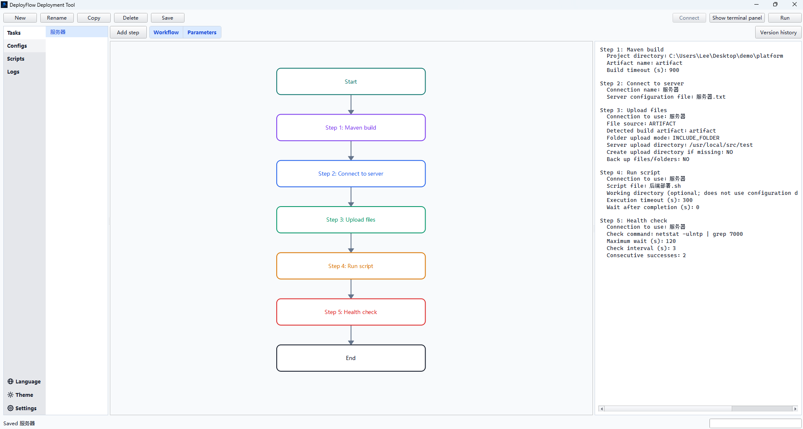
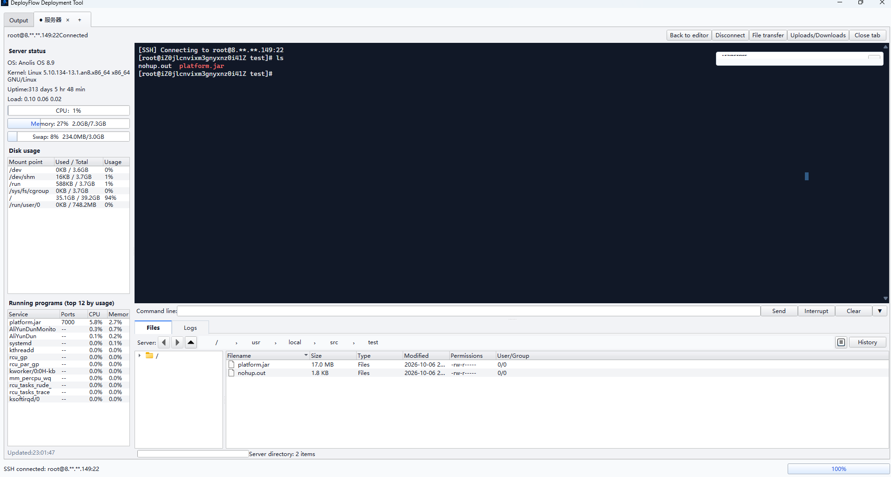
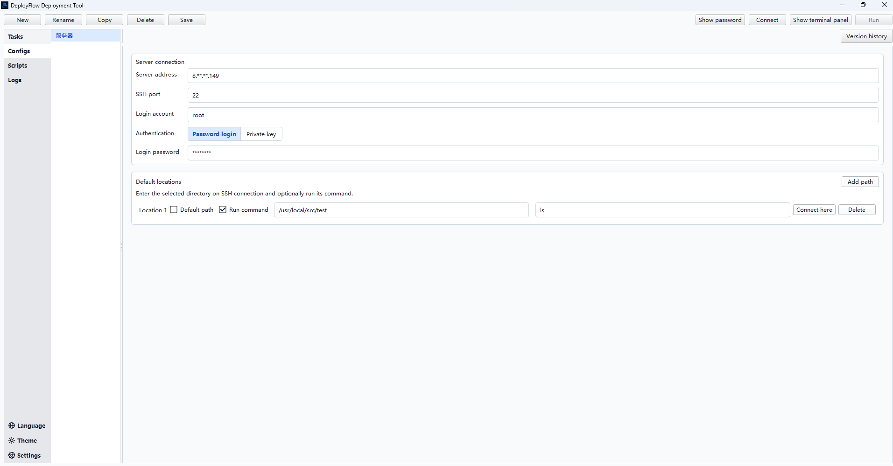
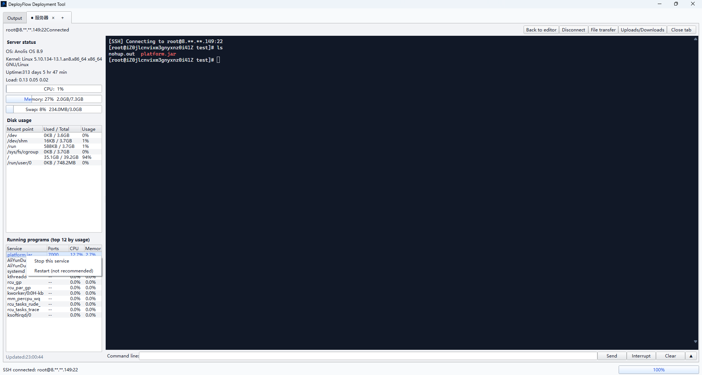
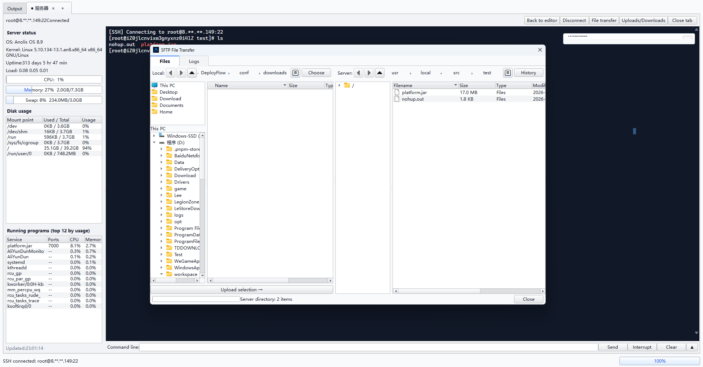
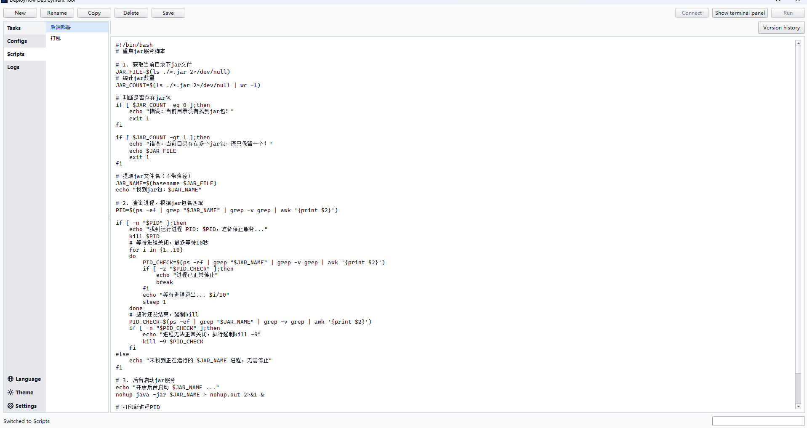
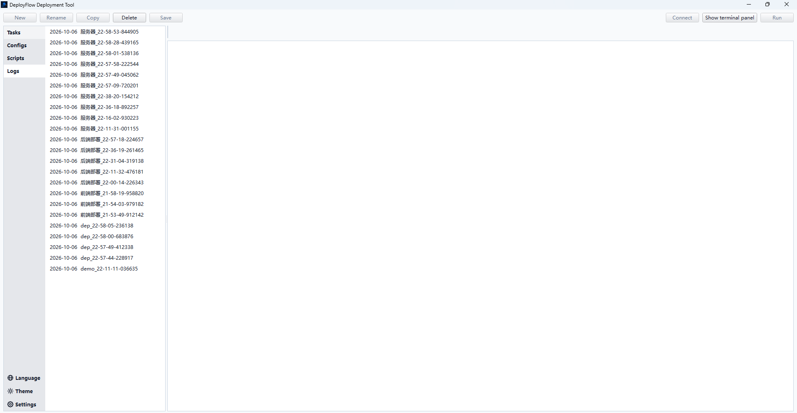

# DeployFlow

**Flujos de despliegue visuales, terminales SSH y gestión de archivos SFTP en una aplicación de escritorio para Windows.**

[English](README.md) · [简体中文](README_CN.md) · [繁體中文](README_TW.md) · [日本語](README_JA.md) · [한국어](README_KO.md) · [Español](README_ES.md)

## ¿Qué problema resuelve?

Para un desarrollador individual o un equipo pequeño, instalar, configurar y mantener una plataforma completa de automatización puede suponer demasiado trabajo para desplegar unos pocos proyectos. Hacerlo todo desde una terminal también tiene inconvenientes: repetir comandos, copiar rutas, cambiar de ventana para transferir archivos y olvidar algún paso.

DeployFlow convierte las herramientas y los scripts existentes en un flujo reutilizable de escritorio: compilar, conectar, subir archivos, ejecutar scripts y comprobar el servicio. Después, permite revisar el resultado desde la terminal y el explorador integrados.

Está pensado para **desarrolladores independientes, equipos pequeños y quienes despliegan o investigan problemas en servidores Linux habitualmente**. Sirve para publicar servicios Java, subir recursos de frontend y realizar tareas de servidor. Actualmente no ofrece planificación centralizada, aprobaciones multiusuario ni ejecución distribuida.



*Ejemplo: Maven → conexión → subida → script de despliegue → comprobación de estado. Las capturas muestran la interfaz en inglés; los contenidos del usuario y las salidas conservan su idioma original.*

## De una lista de pasos a un flujo reutilizable

Cree tareas con pasos ordenados. Un clic muestra sus parámetros, un doble clic permite editarlos y arrastrar cambia el orden. Un paso nuevo se inserta después del seleccionado, o al final si no hay selección. El diagrama y los parámetros pueden mostrarse juntos o por separado.

| Paso | Función |
| --- | --- |
| Conectar al servidor | Crea una conexión SSH con nombre a partir de una configuración guardada. |
| Fusionar／enviar ramas | Ejecuta las operaciones Git pull, merge, commit y push configuradas. |
| Compilar con Maven | Compila el proyecto e identifica el JAR para una subida posterior. |
| Comando／script local | Permite indicar directorio de trabajo, tiempo límite y argumentos del script. |
| Subir archivos | Transfiere un artefacto, archivo o carpeta; opcionalmente crea el destino y respalda archivos existentes. |
| Comando／script remoto | Ejecuta comandos o scripts de Shell mediante una conexión indicada. |
| Esperar | Introduce una pausa entre pasos. |
| Comprobar estado | Repite un comando hasta alcanzar los éxitos consecutivos necesarios o el tiempo límite. |

**Run** ejecuta toda la tarea si no hay selección; con pasos seleccionados, ejecuta solo esos pasos en su orden original. El menú contextual permite ejecutar un paso o empezar desde él. Se muestran salida, progreso y errores, y se puede detener la ejecución.

La ejecución parcial no crea las dependencias omitidas. Incluya en la misma ejecución los pasos de conexión o compilación necesarios.

## Las rutas de la terminal se pueden utilizar directamente

- **Ctrl + pasar el cursor:** subraya la ruta reconocible situada bajo el puntero.
- **Ctrl + clic izquierdo:** cambia al directorio tanto en la terminal como en el panel de archivos. Si es un archivo, abre su carpeta contenedora.
- **Clic derecho sobre una ruta:** funciona con texto seleccionado o directamente sobre la ruta, sin seleccionarla primero. Tras identificarla, aparecen las acciones correspondientes.
- **Acciones de archivo:** editar texto, ejecutar scripts con argumentos opcionales, cambiar permisos, seguir un log, consultar sus últimas N líneas y buscar palabras clave.

La ruta debe poder resolverse en el servidor actual. Los nombres relativos necesitan un contexto de directorio conocido; cada pestaña SSH mantiene el suyo.



## Conexiones y ubicaciones frecuentes

Gestione dirección, puerto, cuenta y autenticación mediante un formulario. Se pueden conservar los datos de contraseña y clave privada; el modo seleccionado determina cuáles se usan. Guarde varias ubicaciones por servidor, con comandos opcionales, elija una predeterminada o conecte directamente a una ubicación concreta.



Incluye protección de contraseñas y **Hide IP**. En las vistas de dirección compatibles, `192.168.10.25` puede mostrarse como `192.**.**.25`, sin cambiar el valor real de conexión. Desactive la ocultación para editar la dirección. Esta función no anonimiza los logs guardados ni cualquier salida remota.

## Espacio de trabajo SSH y monitorización

El botón **+** junto a las pestañas abre otros servidores guardados. Use la terminal bajo el editor o cambie a **Terminal mode** para disponer de más espacio. La terminal utiliza Qt WebEngine y xterm.js, con autocompletado del Shell, historial, copiar/pegar, interrupción y reconexión.

El panel lateral muestra sistema y kernel Linux, tiempo de actividad, carga, CPU, memoria, swap, discos y programas en ejecución con puertos, consumo y detalles de sus comandos.



El menú de procesos permite detenerlos o intentar reiniciarlos. El reinicio figura como **no recomendado**: los datos del proceso no siempre permiten reconstruir el script original, las tuberías y las redirecciones de logs. Cuando sean necesarios, utilice el script original o el gestor de servicios.

## Dos formas de gestionar archivos

La **ventana SFTP de dos paneles** muestra unidades y carpetas locales a la izquierda, y el servidor a la derecha. Suba la selección o arrastre archivos y carpetas desde la lista local o el Explorador de Windows hacia la lista remota.



El **panel remoto integrado**, debajo de la terminal, incluye árbol de directorios, navegación por ruta, historial y detalles. La pestaña **Logs** contigua muestra el registro de la conexión actual.

Ambas vistas permiten subir y descargar, copiar/cortar/pegar remotamente, renombrar, eliminar, crear archivos y carpetas, modificar permisos y abrir un editor de texto independiente. El portapapeles remoto funciona dentro de una misma identidad de conexión al servidor. El panel de transferencias gestiona varios trabajos; eliminar uno activo lo cancela. Tras descargar puede abrir su ubicación, o arrastrar archivos remotos a una carpeta del Explorador para descargarlos allí.

## Scripts, historial y registros

Guarde scripts y reutilícelos desde las tareas. Los formatos locales son `.bat`, `.cmd`, `.ps1`, `.sh` y `.bash`; los scripts remotos de los flujos usan `.sh` o `.bash`.



Las tareas, configuraciones y scripts tienen borradores automáticos; **Save / Ctrl+S** escribe en el archivo principal. El historial permite previsualizar, restaurar, seleccionar varios elementos y eliminarlos. Renombrar configuraciones o scripts dentro de la aplicación actualiza las referencias en los flujos JSON actuales, sus borradores y su historial.

Los logs de ejecución y SSH se guardan por fecha, con la hora de creación en el nombre y marcas de tiempo en las entradas. Aunque se limpie la salida de pantalla, pueden consultarse o eliminarse desde la página de registros.



## Primeros pasos

Se requiere Windows de 64 bits; el entorno de desarrollo actual utiliza Python 3.12. Las operaciones remotas necesitan SSH/SFTP; la monitorización y los scripts remotos se orientan principalmente a Linux. Prepare las herramientas que utilice: Git, JDK, Maven o Maven Wrapper, Node.js/npm y Bash para scripts de Shell locales.

Desde la raíz del proyecto:

```powershell
python -m venv .venv
.\.venv\Scripts\python.exe -m pip install -r requirements.txt
.\start.bat
```

Para iniciar directamente o desde un IDE:

```powershell
.\.venv\Scripts\python.exe app\qt_main.pyw
```

Si dispone de una versión portátil, conserve toda la carpeta y ejecute `DeployFlow.exe`. Guarde primero el servidor y los scripts; cree los pasos, asigne nombres a la conexión y al artefacto, configure sus referencias y directorios, guarde y ejecute.

Ejemplo de frontend: **script local → conexión → subida de carpeta → comando remoto → comprobación de estado**. En un archivo por lotes, `%CD%` es el directorio de trabajo actual y `%~dp0` es el del propio script.

## Controles y apariencia

| Área | Operación |
| --- | --- |
| Flujo | Doble clic para editar, arrastrar para reordenar, Ctrl+clic para selección múltiple, arrastrar en espacio vacío para seleccionar un área. |
| Lienzo | Rueda para zoom; arrastre con el botón derecho para desplazar. |
| Edición | Ctrl+S guarda; Ctrl+rueda en parámetros/texto cambia y recuerda el tamaño de letra. |
| Archivos remotos | Ctrl+C / X / V, Delete, F2, Ctrl+A. |
| Historial | Ctrl+clic, Shift+clic, Ctrl+A. |

La interfaz admite inglés, chino simplificado, chino tradicional, japonés, coreano y español. El idioma inicial es inglés; después se usa la elección guardada y se puede cambiar sin reiniciar. Los contenidos del usuario y las salidas externas no se traducen. Hay colores claros, oscuros, amarillo papel, verde y personalizados; se recuerdan tamaños de paneles, zoom por tarea y tamaño de texto.

## Datos y consideraciones

Los datos permanecen en `conf/`, junto al código fuente o al ejecutable. Las carpetas necesarias se crean automáticamente; la ubicación debe permitir escritura.

```text
conf/
├── tasks/          # Flujos JSON version 2, extensión .txt
├── host/           # Configuraciones de servidores
├── scripts/        # Scripts
├── .drafts/        # Borradores
├── .history/       # Historial de versiones
├── .logs/          # Logs agrupados por fecha
├── .cache/         # Caché
├── downloads/      # Descargas predeterminadas
├── known_hosts     # Claves de hosts SSH
└── settings.json   # Idioma, apariencia y preferencias
```

- El formato antiguo `STEP_xxx=...` ya no se admite. Renombrar fuera de la aplicación no actualiza referencias.
- La ubicación y el comando predeterminados del servidor son para conexiones interactivas. Configure aparte los directorios de los pasos remotos.
- El respaldo al subir es opcional. Un fallo posterior no revierte automáticamente todo el despliegue.
- La protección de contraseñas está vinculada al usuario de Windows; otro equipo o cuenta puede requerir introducirlas de nuevo.
- `conf/` está excluido de Git. Haga copias privadas y seguras; los logs pueden contener direcciones reales incluso con Hide IP activado.

## Empaquetado y licencia

`build.bat` genera la versión portátil en `release/DeployFlow/`. Con Inno Setup 6 disponible, `build_installer.bat` genera el instalador en `installer-output/`. Después de instalar, `conf/` también debe permitir escritura.

Utiliza PySide6, Qt WebEngine, xterm.js y Fabric/Paramiko. El código propio usa [MIT License](LICENSE); las dependencias conservan sus licencias. Las de la terminal están en [app/resources/xterm](app/resources/xterm/). También hay una [presentación del proyecto en chino](docs/PROJECT_OVERVIEW_CN.md).
